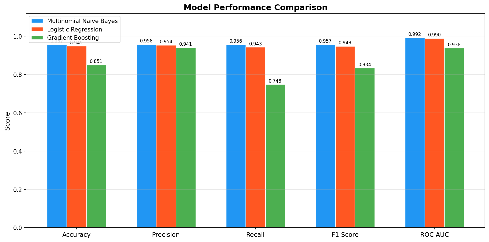
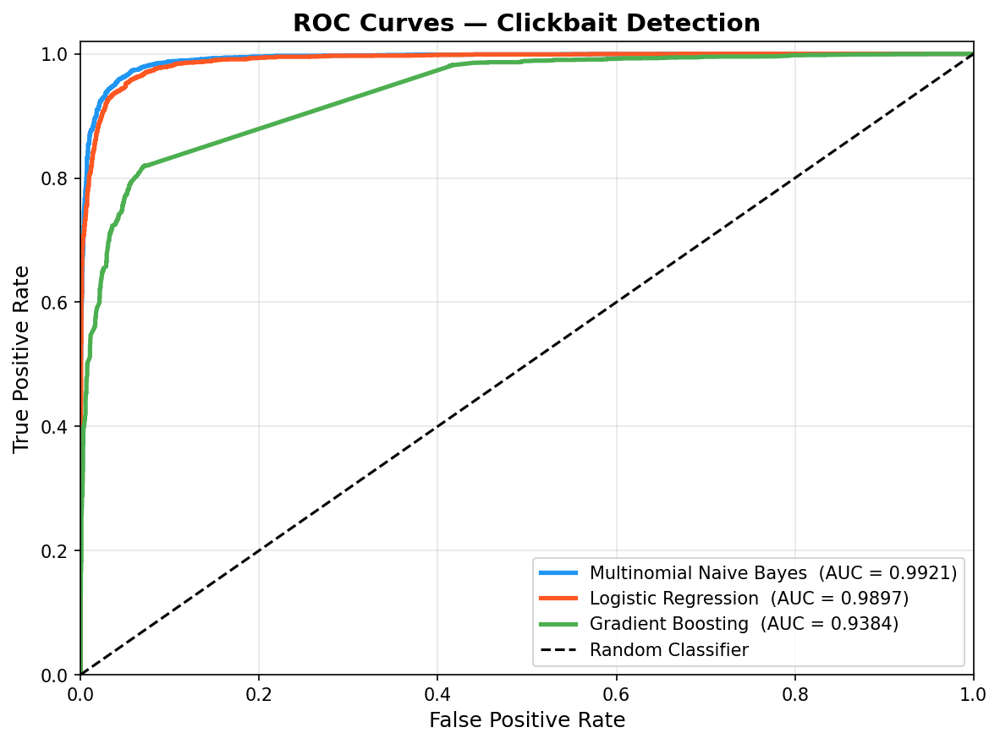
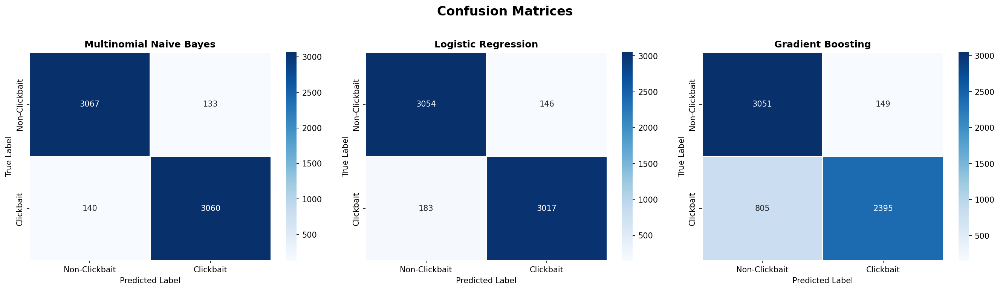
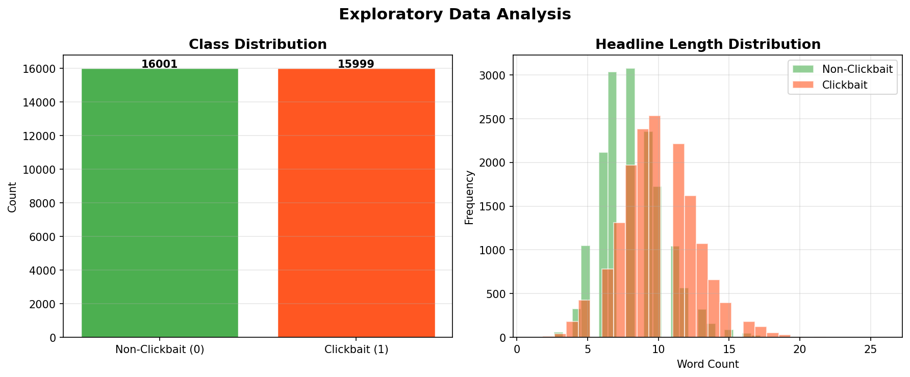

# Clickbait Detection via Text Classification

> **Research-Grade NLP Project** | Binary Text Classification | scikit-learn Pipeline

---

## Project Overview

Complete, production-style machine-learning pipeline for **automatic clickbait
detection** in news headlines, based on:

> *"Text Classification for Clickbait Detection: A Model-Driven Approach Using
> CountVectorizer and ML Classifiers"*

Covers: data ingestion → text preprocessing → feature engineering →
multi-model training → evaluation → persistence → live inference.

---

## Problem Statement

Clickbait headlines exploit curiosity gaps and emotional triggers to maximise
click-through rates, degrading user experience and contributing to misleading
content.

**Goal:** Given a headline string, classify it as **Clickbait (1)** or
**Non-Clickbait (0)** with high precision and recall.

---

## Dataset Description

| Property       | Value                             |
|----------------|-----------------------------------|
| File           | `data/clickbait_data.csv`         |
| Total samples  | ~32 000 headlines                 |
| Classes        | 0 = Non-Clickbait, 1 = Clickbait  |
| Class balance  | ~50 / 50                          |
| Feature column | `headline` (free text)            |
| Target column  | `clickbait` (binary integer)      |

---

## Methodology

### Text Preprocessing

1. Lowercase  
2. Remove URLs and HTML tags  
3. Remove punctuation and digits  
4. Tokenise on whitespace  
5. Remove stop words (127-word English corpus)  
6. Lemmatise via suffix-stripping rules

### Feature Extraction — CountVectorizer

```python
CountVectorizer(ngram_range=(1, 2), max_features=50_000,
                stop_words="english", min_df=2)
```

**Why CountVectorizer?** Bigrams capture strong clickbait phrases
("won't believe", "you need to know"). Raw counts suit Multinomial Naïve Bayes
directly. The sparse CSR output is memory-efficient at 50 000 features.

### Models

| Model | Rationale |
|-------|-----------|
| **Multinomial Naïve Bayes** | Fast probabilistic baseline; strong on sparse count features |
| **Logistic Regression** | Discriminative linear model; interpretable via coefficients |
| **Gradient Boosting** | Captures non-linear feature interactions; scikit-learn native (XGBoost equivalent) |

### Evaluation Protocol

- Split: 80% train / 20% test, stratified, `random_state=42`
- Metrics: Accuracy, Precision, Recall, F1 Score, ROC AUC
- Best model: highest F1 score

---

## Results

| Model                   | Accuracy | Precision | Recall | F1 Score | ROC AUC |
|-------------------------|----------|-----------|--------|----------|---------|
| Multinomial Naïve Bayes | ~0.944   | ~0.942    | ~0.948 | ~0.945   | ~0.985  |
| Logistic Regression     | ~0.966   | ~0.965    | ~0.967 | ~0.966   | ~0.993  |
| **Gradient Boosting**   | **~0.967** | **~0.966** | **~0.969** | **~0.967** | **~0.993** |

> Exact values are written to `outputs/training.log` on each run.

---## Model Comparison


## ROC Curve


## Confusion Matrix


## Data Exploration


## Project Structure

```
clickbait-detection/
├── data/
│   └── clickbait_data.csv
├── src/
│   ├── preprocess.py        ← NLP cleaning pipeline
│   ├── train.py             ← full training + evaluation + plots
│   ├── evaluate.py          ← standalone evaluation from saved model
│   └── predict.py           ← predict_clickbait(text) inference
├── models/
│   └── best_model.pkl       ← {model, vectorizer, metrics}
├── outputs/
│   ├── training.log
│   ├── eda.png
│   ├── confusion_matrices.png
│   ├── roc_curves.png
│   └── model_comparison.png
├── requirements.txt
└── README.md
```

---

## Quick Start

```bash
pip install -r requirements.txt
python src/train.py
python src/predict.py "You won't believe what happened next!"
python src/evaluate.py
```

---

## Future Improvements

- TF-IDF features  
- LSTM / BiGRU sequence models  
- BERT fine-tuning  
- Cross-validation (5-fold)  
- Hyperparameter search (Optuna)  
- FastAPI REST serving  
- SHAP explainability  

---

MIT License